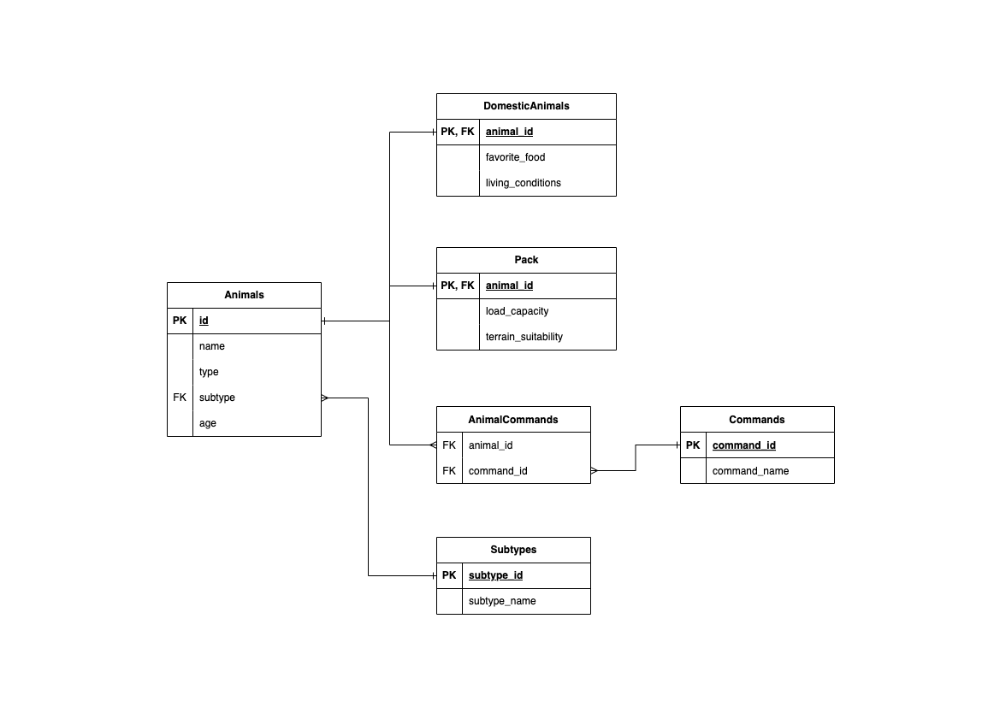

# Задания


## 1. Используя команду cat в терминале операционной системы Linux, создать два файла Домашние животные (заполнив файл собаками, кошками, хомяками) и Вьючные животными заполнив файл Лошадьми, верблюдами и ослы), а затем объединить их. Просмотреть содержимое созданного файла. Переименовать файл, дав ему новое имя (Друзья человека).

```Bash
ubuntu@FinalAttestation-Specialisation:~$ cat > Domestic_animals.txt <<EOL
> dogs
> cats
> hamsters
> EOL
ubuntu@FinalAttestation-Specialisation:~$ cat > Pack_animals.txt <<EOL
> horses
> camels
> donkeys
> EOL
ubuntu@FinalAttestation-Specialisation:~$ cat Domestic_animals.txt Pack_animals.txt > Union.txt
ubuntu@FinalAttestation-Specialisation:~$ cat Union.txt
dogs
cats
hamsters
horses
camels
donkeys
ubuntu@FinalAttestation-Specialisation:~$ mv Union.txt Human_friends.txt
```


## 2. Создать директорию, переместить файл туда.

```Bash
ubuntu@FinalAttestation-Specialisation:~$ mkdir TaskFolder
ubuntu@FinalAttestation-Specialisation:~$ mv Human_friends.txt TaskFolder/Human_friends.txt
```


## 3. Подключить дополнительный репозиторий MySQL. Установить любой пакет из этого репозитория.

```Bash
ubuntu@FinalAttestation-Specialisation:~$ wget https://dev.mysql.com/get/mysql-apt-config_0.8.33-1_all.deb
--2024-10-24 00:10:22--  https://dev.mysql.com/get/mysql-apt-config_0.8.33-1_all.deb
Resolving dev.mysql.com (dev.mysql.com)... 88.221.98.102, 2a02:26f0:9500:98f::2e31, 2a02:26f0:9500:98d::2e31
Connecting to dev.mysql.com (dev.mysql.com)|88.221.98.102|:443... connected.
HTTP request sent, awaiting response... 302 Moved Temporarily
Location: https://repo.mysql.com//mysql-apt-config_0.8.33-1_all.deb [following]
--2024-10-24 00:10:24--  https://repo.mysql.com//mysql-apt-config_0.8.33-1_all.deb
Resolving repo.mysql.com (repo.mysql.com)... 23.37.36.159, 2a02:26f0:e2:780::1d68, 2a02:26f0:e2:782::1d68
Connecting to repo.mysql.com (repo.mysql.com)|23.37.36.159|:443... connected.
HTTP request sent, awaiting response... 200 OK
Length: 18072 (18K) [application/x-debian-package]
Saving to: ‘mysql-apt-config_0.8.33-1_all.deb’

mysql-apt-config_0.8.33-1_all 100%[=================================================>]  17.65K  --.-KB/s    in 0s

2024-10-24 00:10:25 (92.2 MB/s) - ‘mysql-apt-config_0.8.33-1_all.deb’ saved [18072/18072]

ubuntu@FinalAttestation-Specialisation:~$ sudo dpkg -i mysql-apt-config_0.8.33-1_all.deb
(Reading database ... 71967 files and directories currently installed.)
Preparing to unpack mysql-apt-config_0.8.33-1_all.deb ...
Unpacking mysql-apt-config (0.8.33-1) over (0.8.24-1) ...
Setting up mysql-apt-config (0.8.33-1) ...
ubuntu@FinalAttestation-Specialisation:~$ sudo apt update
Hit:1 http://archive.ubuntu.com/ubuntu noble InRelease
Hit:2 http://archive.ubuntu.com/ubuntu noble-updates InRelease
Get:3 http://repo.mysql.com/apt/ubuntu jammy InRelease [25.1 kB]
Hit:4 http://security.ubuntu.com/ubuntu noble-security InRelease
Hit:5 http://archive.ubuntu.com/ubuntu noble-backports InRelease
Get:6 http://repo.mysql.com/apt/ubuntu jammy/mysql-8.4-lts Sources [965 B]
Get:7 http://repo.mysql.com/apt/ubuntu jammy/mysql-apt-config amd64 Packages [566 B]
Get:8 http://repo.mysql.com/apt/ubuntu jammy/mysql-8.4-lts amd64 Packages [14.5 kB]
Get:9 http://repo.mysql.com/apt/ubuntu jammy/mysql-tools amd64 Packages [4176 B]
Fetched 45.3 kB in 1s (52.3 kB/s)
Reading package lists... Done
Building dependency tree... Done
Reading state information... Done
26 packages can be upgraded. Run 'apt list --upgradable' to see them.
ubuntu@FinalAttestation-Specialisation:~/mysql$ sudo apt install mysql-community-server
Reading package lists... Done
Building dependency tree... Done
Reading state information... Done
Some packages could not be installed. This may mean that you have
requested an impossible situation or if you are using the unstable
distribution that some required packages have not yet been created
or been moved out of Incoming.
The following information may help to resolve the situation:

The following packages have unmet dependencies:
 mysql-community-server-core : Depends: libaio1 (>= 0.3.93) but it is not installable
                               Recommends: mecab-ipadic-utf8 but it is not going to be installed
E: Unable to correct problems, you have held broken packages.
ubuntu@FinalAttestation-Specialisation:~/mysql$ wget http://archive.ubuntu.com/ubuntu/pool/main/liba/libaio/libaio1_0.3.110-5_amd64.deb
--2024-10-24 00:32:41--  http://archive.ubuntu.com/ubuntu/pool/main/liba/libaio/libaio1_0.3.110-5_amd64.deb
Resolving archive.ubuntu.com (archive.ubuntu.com)... 91.189.91.81, 185.125.190.82, 185.125.190.81, ...
Connecting to archive.ubuntu.com (archive.ubuntu.com)|91.189.91.81|:80... connected.
HTTP request sent, awaiting response... 200 OK
Length: 6448 (6.3K) [application/vnd.debian.binary-package]
Saving to: ‘libaio1_0.3.110-5_amd64.deb’

libaio1_0.3.110-5_amd64.deb   100%[=================================================>]   6.30K  --.-KB/s    in 0.01s

2024-10-24 00:32:41 (633 KB/s) - ‘libaio1_0.3.110-5_amd64.deb’ saved [6448/6448]

ubuntu@FinalAttestation-Specialisation:~/mysql$ sudo dpkg -i libaio1_0.3.110-5_amd64.deb
Selecting previously unselected package libaio1:amd64.
(Reading database ... 71967 files and directories currently installed.)
Preparing to unpack libaio1_0.3.110-5_amd64.deb ...
Unpacking libaio1:amd64 (0.3.110-5) ...
Setting up libaio1:amd64 (0.3.110-5) ...
Processing triggers for libc-bin (2.39-0ubuntu8.3) ...
ubuntu@FinalAttestation-Specialisation:~/mysql$ sudo apt update
Hit:1 http://repo.mysql.com/apt/ubuntu jammy InRelease
Hit:2 http://security.ubuntu.com/ubuntu noble-security InRelease
Hit:3 http://archive.ubuntu.com/ubuntu noble InRelease
Hit:4 http://archive.ubuntu.com/ubuntu noble-updates InRelease
Hit:5 http://archive.ubuntu.com/ubuntu noble-backports InRelease
Reading package lists... Done
Building dependency tree... Done
Reading state information... Done
26 packages can be upgraded. Run 'apt list --upgradable' to see them.
ubuntu@FinalAttestation-Specialisation:~/mysql$ sudo apt install libaio1
Reading package lists... Done
Building dependency tree... Done
Reading state information... Done
libaio1 is already the newest version (0.3.110-5).
0 upgraded, 0 newly installed, 0 to remove and 26 not upgraded.
ubuntu@FinalAttestation-Specialisation:~/mysql$ sudo apt install mysql-community-server
Reading package lists... Done
Building dependency tree... Done
Reading state information... Done
The following additional packages will be installed:
  libmecab2 mecab-ipadic mecab-ipadic-utf8 mecab-utils mysql-client mysql-common mysql-community-client
  mysql-community-client-core mysql-community-client-plugins mysql-community-server-core
The following NEW packages will be installed:
  libmecab2 mecab-ipadic mecab-ipadic-utf8 mecab-utils mysql-client mysql-common mysql-community-client
  mysql-community-client-core mysql-community-client-plugins mysql-community-server mysql-community-server-core
0 upgraded, 11 newly installed, 0 to remove and 26 not upgraded.
Need to get 43.4 MB of archives.
After this operation, 287 MB of additional disk space will be used.
Do you want to continue? [Y/n] Y
Get:1 http://repo.mysql.com/apt/ubuntu jammy/mysql-8.4-lts amd64 mysql-common amd64 8.4.3-1ubuntu22.04 [60.1 kB]
Get:2 http://archive.ubuntu.com/ubuntu noble/main amd64 libmecab2 amd64 0.996-14ubuntu4 [201 kB]
Get:3 http://repo.mysql.com/apt/ubuntu jammy/mysql-8.4-lts amd64 mysql-community-client-plugins amd64 8.4.3-1ubuntu22.04 [1522 kB]
Get:4 http://repo.mysql.com/apt/ubuntu jammy/mysql-8.4-lts amd64 mysql-community-client-core amd64 8.4.3-1ubuntu22.04 [1865 kB]
Get:5 http://archive.ubuntu.com/ubuntu noble/main amd64 mecab-utils amd64 0.996-14ubuntu4 [4804 B]
Get:6 http://archive.ubuntu.com/ubuntu noble/main amd64 mecab-ipadic all 2.7.0-20070801+main-3 [6718 kB]
Get:7 http://repo.mysql.com/apt/ubuntu jammy/mysql-8.4-lts amd64 mysql-community-client amd64 8.4.3-1ubuntu22.04 [2270 kB]
Get:8 http://repo.mysql.com/apt/ubuntu jammy/mysql-8.4-lts amd64 mysql-client amd64 8.4.3-1ubuntu22.04 [58.8 kB]
Get:9 http://repo.mysql.com/apt/ubuntu jammy/mysql-8.4-lts amd64 mysql-community-server-core amd64 8.4.3-1ubuntu22.04 [30.6 MB]
Get:10 http://archive.ubuntu.com/ubuntu noble/main amd64 mecab-ipadic-utf8 all 2.7.0-20070801+main-3 [4384 B]
Get:11 http://repo.mysql.com/apt/ubuntu jammy/mysql-8.4-lts amd64 mysql-community-server amd64 8.4.3-1ubuntu22.04 [68.8 kB]
Fetched 43.4 MB in 6s (6862 kB/s)
Preconfiguring packages ...
Selecting previously unselected package mysql-common.
(Reading database ... 71974 files and directories currently installed.)
Preparing to unpack .../00-mysql-common_8.4.3-1ubuntu22.04_amd64.deb ...
Unpacking mysql-common (8.4.3-1ubuntu22.04) ...
Selecting previously unselected package mysql-community-client-plugins.
Preparing to unpack .../01-mysql-community-client-plugins_8.4.3-1ubuntu22.04_amd64.deb ...
Unpacking mysql-community-client-plugins (8.4.3-1ubuntu22.04) ...
Selecting previously unselected package mysql-community-client-core.
Preparing to unpack .../02-mysql-community-client-core_8.4.3-1ubuntu22.04_amd64.deb ...
Unpacking mysql-community-client-core (8.4.3-1ubuntu22.04) ...
Selecting previously unselected package mysql-community-client.
Preparing to unpack .../03-mysql-community-client_8.4.3-1ubuntu22.04_amd64.deb ...
Unpacking mysql-community-client (8.4.3-1ubuntu22.04) ...
Selecting previously unselected package mysql-client.
Preparing to unpack .../04-mysql-client_8.4.3-1ubuntu22.04_amd64.deb ...
Unpacking mysql-client (8.4.3-1ubuntu22.04) ...
Selecting previously unselected package libmecab2:amd64.
Preparing to unpack .../05-libmecab2_0.996-14ubuntu4_amd64.deb ...
Unpacking libmecab2:amd64 (0.996-14ubuntu4) ...
Selecting previously unselected package mysql-community-server-core.
Preparing to unpack .../06-mysql-community-server-core_8.4.3-1ubuntu22.04_amd64.deb ...
Unpacking mysql-community-server-core (8.4.3-1ubuntu22.04) ...
Selecting previously unselected package mysql-community-server.
Preparing to unpack .../07-mysql-community-server_8.4.3-1ubuntu22.04_amd64.deb ...
Unpacking mysql-community-server (8.4.3-1ubuntu22.04) ...
Selecting previously unselected package mecab-utils.
Preparing to unpack .../08-mecab-utils_0.996-14ubuntu4_amd64.deb ...
Unpacking mecab-utils (0.996-14ubuntu4) ...
Selecting previously unselected package mecab-ipadic.
Preparing to unpack .../09-mecab-ipadic_2.7.0-20070801+main-3_all.deb ...
Unpacking mecab-ipadic (2.7.0-20070801+main-3) ...
Selecting previously unselected package mecab-ipadic-utf8.
Preparing to unpack .../10-mecab-ipadic-utf8_2.7.0-20070801+main-3_all.deb ...
Unpacking mecab-ipadic-utf8 (2.7.0-20070801+main-3) ...
Setting up libmecab2:amd64 (0.996-14ubuntu4) ...
Setting up mysql-common (8.4.3-1ubuntu22.04) ...
update-alternatives: using /etc/mysql/my.cnf.fallback to provide /etc/mysql/my.cnf (my.cnf) in auto mode
Setting up mysql-community-server-core (8.4.3-1ubuntu22.04) ...
Setting up mecab-utils (0.996-14ubuntu4) ...
Setting up mysql-community-client-plugins (8.4.3-1ubuntu22.04) ...
Setting up mecab-ipadic (2.7.0-20070801+main-3) ...
Compiling IPA dictionary for Mecab.  This takes long time...
reading /usr/share/mecab/dic/ipadic/unk.def ... 40
emitting double-array: 100% |###########################################|
/usr/share/mecab/dic/ipadic/model.def is not found. skipped.
reading /usr/share/mecab/dic/ipadic/Noun.adverbal.csv ... 795
reading /usr/share/mecab/dic/ipadic/Noun.adjv.csv ... 3328
reading /usr/share/mecab/dic/ipadic/Postp-col.csv ... 91
reading /usr/share/mecab/dic/ipadic/Noun.csv ... 60477
reading /usr/share/mecab/dic/ipadic/Interjection.csv ... 252
reading /usr/share/mecab/dic/ipadic/Filler.csv ... 19
reading /usr/share/mecab/dic/ipadic/Noun.others.csv ... 151
reading /usr/share/mecab/dic/ipadic/Noun.proper.csv ... 27328
reading /usr/share/mecab/dic/ipadic/Noun.nai.csv ... 42
reading /usr/share/mecab/dic/ipadic/Symbol.csv ... 208
reading /usr/share/mecab/dic/ipadic/Verb.csv ... 130750
reading /usr/share/mecab/dic/ipadic/Prefix.csv ... 221
reading /usr/share/mecab/dic/ipadic/Adverb.csv ... 3032
reading /usr/share/mecab/dic/ipadic/Noun.name.csv ... 34202
reading /usr/share/mecab/dic/ipadic/Suffix.csv ... 1393
reading /usr/share/mecab/dic/ipadic/Postp.csv ... 146
reading /usr/share/mecab/dic/ipadic/Noun.number.csv ... 42
reading /usr/share/mecab/dic/ipadic/Adnominal.csv ... 135
reading /usr/share/mecab/dic/ipadic/Conjunction.csv ... 171
reading /usr/share/mecab/dic/ipadic/Noun.demonst.csv ... 120
reading /usr/share/mecab/dic/ipadic/Auxil.csv ... 199
reading /usr/share/mecab/dic/ipadic/Adj.csv ... 27210
reading /usr/share/mecab/dic/ipadic/Noun.place.csv ... 72999
reading /usr/share/mecab/dic/ipadic/Others.csv ... 2
reading /usr/share/mecab/dic/ipadic/Noun.verbal.csv ... 12146
reading /usr/share/mecab/dic/ipadic/Noun.org.csv ... 16668
emitting double-array: 100% |###########################################|
reading /usr/share/mecab/dic/ipadic/matrix.def ... 1316x1316
emitting matrix      : 100% |###########################################|

done!
update-alternatives: using /var/lib/mecab/dic/ipadic to provide /var/lib/mecab/dic/debian (mecab-dictionary) in auto mode
Setting up mysql-community-client-core (8.4.3-1ubuntu22.04) ...
Setting up mecab-ipadic-utf8 (2.7.0-20070801+main-3) ...
Compiling IPA dictionary for Mecab.  This takes long time...
reading /usr/share/mecab/dic/ipadic/unk.def ... 40
emitting double-array: 100% |###########################################|
/usr/share/mecab/dic/ipadic/model.def is not found. skipped.
reading /usr/share/mecab/dic/ipadic/Noun.adverbal.csv ... 795
reading /usr/share/mecab/dic/ipadic/Noun.adjv.csv ... 3328
reading /usr/share/mecab/dic/ipadic/Postp-col.csv ... 91
reading /usr/share/mecab/dic/ipadic/Noun.csv ... 60477
reading /usr/share/mecab/dic/ipadic/Interjection.csv ... 252
reading /usr/share/mecab/dic/ipadic/Filler.csv ... 19
reading /usr/share/mecab/dic/ipadic/Noun.others.csv ... 151
reading /usr/share/mecab/dic/ipadic/Noun.proper.csv ... 27328
reading /usr/share/mecab/dic/ipadic/Noun.nai.csv ... 42
reading /usr/share/mecab/dic/ipadic/Symbol.csv ... 208
reading /usr/share/mecab/dic/ipadic/Verb.csv ... 130750
reading /usr/share/mecab/dic/ipadic/Prefix.csv ... 221
reading /usr/share/mecab/dic/ipadic/Adverb.csv ... 3032
reading /usr/share/mecab/dic/ipadic/Noun.name.csv ... 34202
reading /usr/share/mecab/dic/ipadic/Suffix.csv ... 1393
reading /usr/share/mecab/dic/ipadic/Postp.csv ... 146
reading /usr/share/mecab/dic/ipadic/Noun.number.csv ... 42
reading /usr/share/mecab/dic/ipadic/Adnominal.csv ... 135
reading /usr/share/mecab/dic/ipadic/Conjunction.csv ... 171
reading /usr/share/mecab/dic/ipadic/Noun.demonst.csv ... 120
reading /usr/share/mecab/dic/ipadic/Auxil.csv ... 199
reading /usr/share/mecab/dic/ipadic/Adj.csv ... 27210
reading /usr/share/mecab/dic/ipadic/Noun.place.csv ... 72999
reading /usr/share/mecab/dic/ipadic/Others.csv ... 2
reading /usr/share/mecab/dic/ipadic/Noun.verbal.csv ... 12146
reading /usr/share/mecab/dic/ipadic/Noun.org.csv ... 16668
emitting double-array: 100% |###########################################|
reading /usr/share/mecab/dic/ipadic/matrix.def ... 1316x1316
emitting matrix      : 100% |###########################################|

done!
update-alternatives: using /var/lib/mecab/dic/ipadic-utf8 to provide /var/lib/mecab/dic/debian (mecab-dictionary) in auto mode
Setting up mysql-community-client (8.4.3-1ubuntu22.04) ...
Setting up mysql-client (8.4.3-1ubuntu22.04) ...
Setting up mysql-community-server (8.4.3-1ubuntu22.04) ...
update-alternatives: using /etc/mysql/mysql.cnf to provide /etc/mysql/my.cnf (my.cnf) in auto mode
Created symlink /etc/systemd/system/multi-user.target.wants/mysql.service → /usr/lib/systemd/system/mysql.service.
Processing triggers for man-db (2.12.0-4build2) ...
Processing triggers for libc-bin (2.39-0ubuntu8.3) ...
needrestart is being skipped since dpkg has failed
ubuntu@FinalAttestation-Specialisation:~/mysql$ sudo systemctl status mysql
● mysql.service - MySQL Community Server
     Loaded: loaded (/usr/lib/systemd/system/mysql.service; enabled; preset: enabled)
     Active: active (running) since Thu 2024-10-24 00:36:30 MSK; 1min 9s ago
       Docs: man:mysqld(8)
             http://dev.mysql.com/doc/refman/en/using-systemd.html
   Main PID: 4630 (mysqld)
     Status: "Server is operational"
      Tasks: 34 (limit: 1106)
     Memory: 427.3M (peak: 443.9M)
        CPU: 1.892s
     CGroup: /system.slice/mysql.service
             └─4630 /usr/sbin/mysqld

Oct 24 00:36:29 FinalAttestation-Specialisation systemd[1]: Starting mysql.service - MySQL Community Server...
Oct 24 00:36:30 FinalAttestation-Specialisation systemd[1]: Started mysql.service - MySQL Community Server.
```


## 4. Установить и удалить deb-пакет с помощью dpkg.

```Bash
ubuntu@FinalAttestation-Specialisation:~/mysql$ sudo systemctl stop mysql
ubuntu@FinalAttestation-Specialisation:~/mysql$ sudo systemctl status mysql
○ mysql.service - MySQL Community Server
     Loaded: loaded (/usr/lib/systemd/system/mysql.service; enabled; preset: enabled)
     Active: inactive (dead) since Thu 2024-10-24 00:42:19 MSK; 7s ago
   Duration: 5min 48.546s
       Docs: man:mysqld(8)
             http://dev.mysql.com/doc/refman/en/using-systemd.html
    Process: 4630 ExecStart=/usr/sbin/mysqld (code=exited, status=0/SUCCESS)
   Main PID: 4630 (code=exited, status=0/SUCCESS)
     Status: "Server shutdown complete (with return value = 0)"
        CPU: 5.369s

Oct 24 00:36:29 FinalAttestation-Specialisation systemd[1]: Starting mysql.service - MySQL Community Server...
Oct 24 00:36:30 FinalAttestation-Specialisation systemd[1]: Started mysql.service - MySQL Community Server.
Oct 24 00:42:19 FinalAttestation-Specialisation systemd[1]: Stopping mysql.service - MySQL Community Server...
Oct 24 00:42:19 FinalAttestation-Specialisation systemd[1]: mysql.service: Deactivated successfully.
Oct 24 00:42:19 FinalAttestation-Specialisation systemd[1]: Stopped mysql.service - MySQL Community Server.
Oct 24 00:42:19 FinalAttestation-Specialisation systemd[1]: mysql.service: Consumed 5.369s CPU time, 443.9M memory peak>
ubuntu@FinalAttestation-Specialisation:~/mysql$ sudo dpkg -r mysql-community-server
(Reading database ... 72394 files and directories currently installed.)
Removing mysql-community-server (8.4.3-1ubuntu22.04) ...
update-alternatives: using /etc/mysql/my.cnf.fallback to provide /etc/mysql/my.cnf (my.cnf) in auto mode
ubuntu@FinalAttestation-Specialisation:~/mysql$ sudo dpkg --purge mysql-community-server
(Reading database ... 72380 files and directories currently installed.)
Purging configuration files for mysql-community-server (8.4.3-1ubuntu22.04) ...
```


## 5. Выложить историю команд в терминале ubuntu

> Все задачи сопровождаются непрерывной историей взаимодействия с терминалом, далее часть перед заданием №6.
> 

```Bash
ubuntu@FinalAttestation-Specialisation:~/MySQL$ sudo apt-get install mysql-server
Reading package lists... Done
Building dependency tree... Done
Reading state information... Done
The following additional packages will be installed:
  libmecab2 mecab-ipadic mecab-ipadic-utf8 mecab-utils mysql-client mysql-common mysql-community-client mysql-community-client-core mysql-community-client-plugins mysql-community-server
  mysql-community-server-core
The following NEW packages will be installed:
  libmecab2 mecab-ipadic mecab-ipadic-utf8 mecab-utils mysql-client mysql-common mysql-community-client mysql-community-client-core mysql-community-client-plugins mysql-community-server
  mysql-community-server-core mysql-server
0 upgraded, 12 newly installed, 0 to remove and 0 not upgraded.
Need to get 43.3 MB of archives.
After this operation, 287 MB of additional disk space will be used.
Do you want to continue? [Y/n] Y
Get:1 http://archive.ubuntu.com/ubuntu noble/main amd64 libmecab2 amd64 0.996-14ubuntu4 [201 kB]
Get:2 http://repo.mysql.com/apt/ubuntu noble/mysql-8.4-lts amd64 mysql-common amd64 8.4.3-1ubuntu24.04 [59.1 kB]
Get:3 http://repo.mysql.com/apt/ubuntu noble/mysql-8.4-lts amd64 mysql-community-client-plugins amd64 8.4.3-1ubuntu24.04 [1435 kB]
Get:4 http://archive.ubuntu.com/ubuntu noble/main amd64 mecab-utils amd64 0.996-14ubuntu4 [4804 B]
Get:5 http://archive.ubuntu.com/ubuntu noble/main amd64 mecab-ipadic all 2.7.0-20070801+main-3 [6718 kB]
Get:6 http://repo.mysql.com/apt/ubuntu noble/mysql-8.4-lts amd64 mysql-community-client-core amd64 8.4.3-1ubuntu24.04 [1786 kB]
Get:7 http://repo.mysql.com/apt/ubuntu noble/mysql-8.4-lts amd64 mysql-community-client amd64 8.4.3-1ubuntu24.04 [2151 kB]
Get:8 http://repo.mysql.com/apt/ubuntu noble/mysql-8.4-lts amd64 mysql-client amd64 8.4.3-1ubuntu24.04 [57.8 kB]
Get:9 http://repo.mysql.com/apt/ubuntu noble/mysql-8.4-lts amd64 mysql-community-server-core amd64 8.4.3-1ubuntu24.04 [30.8 MB]
Get:10 http://archive.ubuntu.com/ubuntu noble/main amd64 mecab-ipadic-utf8 all 2.7.0-20070801+main-3 [4384 B]
Get:11 http://repo.mysql.com/apt/ubuntu noble/mysql-8.4-lts amd64 mysql-community-server amd64 8.4.3-1ubuntu24.04 [67.4 kB]
Get:12 http://repo.mysql.com/apt/ubuntu noble/mysql-8.4-lts amd64 mysql-server amd64 8.4.3-1ubuntu24.04 [57.8 kB]
Fetched 43.3 MB in 5s (8088 kB/s)
Preconfiguring packages ...
Selecting previously unselected package mysql-common.
(Reading database ... 106325 files and directories currently installed.)
Preparing to unpack .../00-mysql-common_8.4.3-1ubuntu24.04_amd64.deb ...
Unpacking mysql-common (8.4.3-1ubuntu24.04) ...
Selecting previously unselected package mysql-community-client-plugins.
Preparing to unpack .../01-mysql-community-client-plugins_8.4.3-1ubuntu24.04_amd64.deb ...
Unpacking mysql-community-client-plugins (8.4.3-1ubuntu24.04) ...
Selecting previously unselected package mysql-community-client-core.
Preparing to unpack .../02-mysql-community-client-core_8.4.3-1ubuntu24.04_amd64.deb ...
Unpacking mysql-community-client-core (8.4.3-1ubuntu24.04) ...
Selecting previously unselected package mysql-community-client.
Preparing to unpack .../03-mysql-community-client_8.4.3-1ubuntu24.04_amd64.deb ...
Unpacking mysql-community-client (8.4.3-1ubuntu24.04) ...
Selecting previously unselected package mysql-client.
Preparing to unpack .../04-mysql-client_8.4.3-1ubuntu24.04_amd64.deb ...
Unpacking mysql-client (8.4.3-1ubuntu24.04) ...
Selecting previously unselected package libmecab2:amd64.
Preparing to unpack .../05-libmecab2_0.996-14ubuntu4_amd64.deb ...
Unpacking libmecab2:amd64 (0.996-14ubuntu4) ...
Selecting previously unselected package mysql-community-server-core.
Preparing to unpack .../06-mysql-community-server-core_8.4.3-1ubuntu24.04_amd64.deb ...
Unpacking mysql-community-server-core (8.4.3-1ubuntu24.04) ...
Selecting previously unselected package mysql-community-server.
Preparing to unpack .../07-mysql-community-server_8.4.3-1ubuntu24.04_amd64.deb ...
Unpacking mysql-community-server (8.4.3-1ubuntu24.04) ...
Selecting previously unselected package mecab-utils.
Preparing to unpack .../08-mecab-utils_0.996-14ubuntu4_amd64.deb ...
Unpacking mecab-utils (0.996-14ubuntu4) ...
Selecting previously unselected package mecab-ipadic.
Preparing to unpack .../09-mecab-ipadic_2.7.0-20070801+main-3_all.deb ...
Unpacking mecab-ipadic (2.7.0-20070801+main-3) ...
Selecting previously unselected package mecab-ipadic-utf8.
Preparing to unpack .../10-mecab-ipadic-utf8_2.7.0-20070801+main-3_all.deb ...
Unpacking mecab-ipadic-utf8 (2.7.0-20070801+main-3) ...
Selecting previously unselected package mysql-server.
Preparing to unpack .../11-mysql-server_8.4.3-1ubuntu24.04_amd64.deb ...
Unpacking mysql-server (8.4.3-1ubuntu24.04) ...
Setting up libmecab2:amd64 (0.996-14ubuntu4) ...
Setting up mysql-common (8.4.3-1ubuntu24.04) ...
update-alternatives: using /etc/mysql/my.cnf.fallback to provide /etc/mysql/my.cnf (my.cnf) in auto mode
Setting up mysql-community-server-core (8.4.3-1ubuntu24.04) ...
Setting up mecab-utils (0.996-14ubuntu4) ...
Setting up mysql-community-client-plugins (8.4.3-1ubuntu24.04) ...
Setting up mecab-ipadic (2.7.0-20070801+main-3) ...
Compiling IPA dictionary for Mecab.  This takes long time...
reading /usr/share/mecab/dic/ipadic/unk.def ... 40
emitting double-array: 100% |###########################################|
/usr/share/mecab/dic/ipadic/model.def is not found. skipped.
reading /usr/share/mecab/dic/ipadic/Noun.adverbal.csv ... 795
reading /usr/share/mecab/dic/ipadic/Noun.adjv.csv ... 3328
reading /usr/share/mecab/dic/ipadic/Postp-col.csv ... 91
reading /usr/share/mecab/dic/ipadic/Noun.csv ... 60477
reading /usr/share/mecab/dic/ipadic/Interjection.csv ... 252
reading /usr/share/mecab/dic/ipadic/Filler.csv ... 19
reading /usr/share/mecab/dic/ipadic/Noun.others.csv ... 151
reading /usr/share/mecab/dic/ipadic/Noun.proper.csv ... 27328
reading /usr/share/mecab/dic/ipadic/Noun.nai.csv ... 42
reading /usr/share/mecab/dic/ipadic/Symbol.csv ... 208
reading /usr/share/mecab/dic/ipadic/Verb.csv ... 130750
reading /usr/share/mecab/dic/ipadic/Prefix.csv ... 221
reading /usr/share/mecab/dic/ipadic/Adverb.csv ... 3032
reading /usr/share/mecab/dic/ipadic/Noun.name.csv ... 34202
reading /usr/share/mecab/dic/ipadic/Suffix.csv ... 1393
reading /usr/share/mecab/dic/ipadic/Postp.csv ... 146
reading /usr/share/mecab/dic/ipadic/Noun.number.csv ... 42
reading /usr/share/mecab/dic/ipadic/Adnominal.csv ... 135
reading /usr/share/mecab/dic/ipadic/Conjunction.csv ... 171
reading /usr/share/mecab/dic/ipadic/Noun.demonst.csv ... 120
reading /usr/share/mecab/dic/ipadic/Auxil.csv ... 199
reading /usr/share/mecab/dic/ipadic/Adj.csv ... 27210
reading /usr/share/mecab/dic/ipadic/Noun.place.csv ... 72999
reading /usr/share/mecab/dic/ipadic/Others.csv ... 2
reading /usr/share/mecab/dic/ipadic/Noun.verbal.csv ... 12146
reading /usr/share/mecab/dic/ipadic/Noun.org.csv ... 16668
emitting double-array: 100% |###########################################|
reading /usr/share/mecab/dic/ipadic/matrix.def ... 1316x1316
emitting matrix      : 100% |###########################################|

done!
update-alternatives: using /var/lib/mecab/dic/ipadic to provide /var/lib/mecab/dic/debian (mecab-dictionary) in auto mode
Setting up mysql-community-client-core (8.4.3-1ubuntu24.04) ...
Setting up mecab-ipadic-utf8 (2.7.0-20070801+main-3) ...
Compiling IPA dictionary for Mecab.  This takes long time...
reading /usr/share/mecab/dic/ipadic/unk.def ... 40
emitting double-array: 100% |###########################################|
/usr/share/mecab/dic/ipadic/model.def is not found. skipped.
reading /usr/share/mecab/dic/ipadic/Noun.adverbal.csv ... 795
reading /usr/share/mecab/dic/ipadic/Noun.adjv.csv ... 3328
reading /usr/share/mecab/dic/ipadic/Postp-col.csv ... 91
reading /usr/share/mecab/dic/ipadic/Noun.csv ... 60477
reading /usr/share/mecab/dic/ipadic/Interjection.csv ... 252
reading /usr/share/mecab/dic/ipadic/Filler.csv ... 19
reading /usr/share/mecab/dic/ipadic/Noun.others.csv ... 151
reading /usr/share/mecab/dic/ipadic/Noun.proper.csv ... 27328
reading /usr/share/mecab/dic/ipadic/Noun.nai.csv ... 42
reading /usr/share/mecab/dic/ipadic/Symbol.csv ... 208
reading /usr/share/mecab/dic/ipadic/Verb.csv ... 130750
reading /usr/share/mecab/dic/ipadic/Prefix.csv ... 221
reading /usr/share/mecab/dic/ipadic/Adverb.csv ... 3032
reading /usr/share/mecab/dic/ipadic/Noun.name.csv ... 34202
reading /usr/share/mecab/dic/ipadic/Suffix.csv ... 1393
reading /usr/share/mecab/dic/ipadic/Postp.csv ... 146
reading /usr/share/mecab/dic/ipadic/Noun.number.csv ... 42
reading /usr/share/mecab/dic/ipadic/Adnominal.csv ... 135
reading /usr/share/mecab/dic/ipadic/Conjunction.csv ... 171
reading /usr/share/mecab/dic/ipadic/Noun.demonst.csv ... 120
reading /usr/share/mecab/dic/ipadic/Auxil.csv ... 199
reading /usr/share/mecab/dic/ipadic/Adj.csv ... 27210
reading /usr/share/mecab/dic/ipadic/Noun.place.csv ... 72999
reading /usr/share/mecab/dic/ipadic/Others.csv ... 2
reading /usr/share/mecab/dic/ipadic/Noun.verbal.csv ... 12146
reading /usr/share/mecab/dic/ipadic/Noun.org.csv ... 16668
emitting double-array: 100% |###########################################|
reading /usr/share/mecab/dic/ipadic/matrix.def ... 1316x1316
emitting matrix      : 100% |###########################################|

done!
update-alternatives: using /var/lib/mecab/dic/ipadic-utf8 to provide /var/lib/mecab/dic/debian (mecab-dictionary) in auto mode
Setting up mysql-community-client (8.4.3-1ubuntu24.04) ...
Setting up mysql-client (8.4.3-1ubuntu24.04) ...
Setting up mysql-community-server (8.4.3-1ubuntu24.04) ...
update-alternatives: using /etc/mysql/mysql.cnf to provide /etc/mysql/my.cnf (my.cnf) in auto mode
Created symlink /etc/systemd/system/multi-user.target.wants/mysql.service → /usr/lib/systemd/system/mysql.service.
Setting up mysql-server (8.4.3-1ubuntu24.04) ...
Processing triggers for man-db (2.12.0-4build2) ...
Processing triggers for libc-bin (2.39-0ubuntu8.3) ...
Scanning processes...
Scanning candidates...
Scanning linux images...

Pending kernel upgrade!
Running kernel version:
  6.8.0-45-generic
Diagnostics:
  The currently running kernel version is not the expected kernel version 6.8.0-47-generic.

Restarting the system to load the new kernel will not be handled automatically, so you should consider rebooting.

Restarting services...

Service restarts being deferred:
 systemctl restart unattended-upgrades.service

No containers need to be restarted.

No user sessions are running outdated binaries.

No VM guests are running outdated hypervisor (qemu) binaries on this host.
ubuntu@FinalAttestation-Specialisation:~/MySQL$ systemctl status mysql
● mysql.service - MySQL Community Server
     Loaded: loaded (/usr/lib/systemd/system/mysql.service; enabled; preset: enabled)
     Active: active (running) since Sat 2024-10-26 23:23:16 MSK; 24s ago
       Docs: man:mysqld(8)
             http://dev.mysql.com/doc/refman/en/using-systemd.html
   Main PID: 12227 (mysqld)
     Status: "Server is operational"
      Tasks: 35 (limit: 1106)
     Memory: 426.9M (peak: 444.3M)
        CPU: 1.246s
     CGroup: /system.slice/mysql.service
             └─12227 /usr/sbin/mysqld

Oct 26 23:23:15 FinalAttestation-Specialisation systemd[1]: Starting mysql.service - MySQL Community Server...
Oct 26 23:23:16 FinalAttestation-Specialisation systemd[1]: Started mysql.service - MySQL Community Server.
```


## 6. Нарисовать диаграмму, в которой есть класс родительский класс, домашние животные и вьючные животные, в составы которых в случае домашних животных войдут классы: собаки, кошки, хомяки, а в класс вьючные животные войдут: Лошади, верблюды и ослы).




## 7. В подключенном MySQL репозитории создать базу данных “Друзья человека”

```Bash
ubuntu@FinalAttestation-Specialisation:~/MySQL$ mysql
ERROR 1045 (28000): Access denied for user 'ubuntu'@'localhost' (using password: NO)
ubuntu@FinalAttestation-Specialisation:~/MySQL$ sudo mysql
ERROR 1045 (28000): Access denied for user 'root'@'localhost' (using password: NO)
ubuntu@FinalAttestation-Specialisation:~/MySQL$ mysql -u root -p
Enter password:
Welcome to the MySQL monitor.  Commands end with ; or \g.
Your MySQL connection id is 10
Server version: 8.4.3 MySQL Community Server - GPL

Copyright (c) 2000, 2024, Oracle and/or its affiliates.

Oracle is a registered trademark of Oracle Corporation and/or its
affiliates. Other names may be trademarks of their respective
owners.

Type 'help;' or '\h' for help. Type '\c' to clear the current input statement.

mysql> CREATE DATABASE Kennel; USE Kennel;
Query OK, 1 row affected (0.00 sec)

Database changed
mysql> SHOW DATABASES;
+--------------------+
| Database           |
+--------------------+
| Kennel             |
| information_schema |
| mysql              |
| performance_schema |
| sys                |
+--------------------+
5 rows in set (0.00 sec)

mysql> USE Kennel
Database changed
mysql> SHOW TABLES;
Empty set (0.00 sec)
```


## 8. Создать таблицы с иерархией из диаграммы в БД

```Bash
mysql> CREATE TABLE Animals (
    -> id INT PRIMARY KEY AUTO_INCREMENT,
    -> name VARCHAR(100) NOT NULL,
    -> type ENUM('domestic', 'pack') NOT NULL,
    -> age INT NOT NULL
    -> );
Query OK, 0 rows affected (0.03 sec)

mysql> SHOW TABLES
    -> ;
+------------------+
| Tables_in_Kennel |
+------------------+
| Animals          |
+------------------+
1 row in set (0.00 sec)

mysql> CREATE TABLE PackAnimals (
    ->     animal_id INT PRIMARY KEY,
    ->     load_capacity FLOAT NOT NULL,
    ->     terrain_suitability VARCHAR(100),
    ->     FOREIGN KEY (animal_id) REFERENCES Animals(id)
    -> );
Query OK, 0 rows affected (0.03 sec)

mysql> SHOW TABLES;
+------------------+
| Tables_in_Kennel |
+------------------+
| Animals          |
| PackAnimals      |
+------------------+
2 rows in set (0.00 sec)

mysql> CREATE TABLE DomesticAnimals (
    ->     animal_id INT PRIMARY KEY,
    ->     favorite_food VARCHAR(100),
    ->     living_conditions VARCHAR(100),
    ->     FOREIGN KEY (animal_id) REFERENCES Animals(id)
    -> );
Query OK, 0 rows affected (0.03 sec)

mysql> CREATE TABLE Commands (
    ->     command_id INT PRIMARY KEY AUTO_INCREMENT,
    ->     command_name VARCHAR(100) NOT NULL UNIQUE
    -> );
Query OK, 0 rows affected (0.03 sec)

mysql> CREATE TABLE AnimalCommands (
    ->     animal_id INT,
    ->     command_id INT,
    ->     PRIMARY KEY (animal_id, command_id),
    ->     FOREIGN KEY (animal_id) REFERENCES Animals(id),
    ->     FOREIGN KEY (command_id) REFERENCES Commands(command_id)
    -> );
Query OK, 0 rows affected (0.04 sec)

mysql> SHOW TABLES;
+------------------+
| Tables_in_Kennel |
+------------------+
| AnimalCommands   |
| Animals          |
| Commands         |
| DomesticAnimals  |
| PackAnimals      |
+------------------+
5 rows in set (0.01 sec)

mysql> CREATE TABLE Subtypes (
    ->     subtype_id INT PRIMARY KEY AUTO_INCREMENT,
    ->     subtype_name VARCHAR(50) NOT NULL UNIQUE
    -> );
Query OK, 0 rows affected (0.03 sec)

mysql> ALTER TABLE Animals
    -> ADD COLUMN subtype_id INT,
    -> ADD CONSTRAINT fk_subtype
    ->     FOREIGN KEY (subtype_id) REFERENCES Subtypes(subtype_id);
Query OK, 0 rows affected (0.07 sec)
Records: 0  Duplicates: 0  Warnings: 0

mysql> SHOW TABLES
    -> ;
+------------------+
| Tables_in_Kennel |
+------------------+
| AnimalCommands   |
| Animals          |
| Commands         |
| DomesticAnimals  |
| PackAnimals      |
| Subtypes         |
+------------------+
6 rows in set (0.00 sec)
```


## 9. Заполнить низкоуровневые таблицы именами(животных), командами которые они выполняют и датами рождения

```Bash
mysql> INSERT INTO Commands (command_name) VALUES
    ->     ('sit'),
    ->     ('stay'),
    ->     ('come'),
    ->     ('fetch'),
    ->     ('roll over'),
    ->     ('heel'),
    ->     ('speak'),
    ->     ('shake'),
    ->     ('jump'),
    ->     ('guard'),
    ->     ('attack'),
    ->     ('herd');
Query OK, 12 rows affected (0.07 sec)
Records: 12  Duplicates: 0  Warnings: 0

mysql> INSERT INTO Subtypes (subtype_name) VALUES
    ->     ('dog'),
    ->     ('cat'),
    ->     ('hamster'),
    ->     ('horse'),
    ->     ('camel'),
    ->     ('donkey');
Query OK, 6 rows affected (0.01 sec)
Records: 6  Duplicates: 0  Warnings: 0

mysql> INSERT INTO Animals (name, type, subtype_id, age) VALUES
    ->     ('Buddy', 'domestic', (SELECT subtype_id FROM Subtypes WHERE subtype_name = 'dog'), 3),
    ->     ('Charlie', 'domestic', (SELECT subtype_id FROM Subtypes WHERE subtype_name = 'dog'), 5),
    ->     ('Whiskers', 'domestic', (SELECT subtype_id FROM Subtypes WHERE subtype_name = 'cat'), 2),
    ->     ('Mittens', 'domestic', (SELECT subtype_id FROM Subtypes WHERE subtype_name = 'cat'), 4),
    ->     ('Nibbles', 'domestic', (SELECT subtype_id FROM Subtypes WHERE subtype_name = 'hamster'), 1),
    ->     ('Chewy', 'domestic', (SELECT subtype_id FROM Subtypes WHERE subtype_name = 'hamster'), 2),
    ->     ('Spirit', 'pack', (SELECT subtype_id FROM Subtypes WHERE subtype_name = 'horse'), 8),
    ->     ('Majesty', 'pack', (SELECT subtype_id FROM Subtypes WHERE subtype_name = 'horse'), 10),
    ->     ('Oasis', 'pack', (SELECT subtype_id FROM Subtypes WHERE subtype_name = 'camel'), 12),
    ->     ('Dune', 'pack', (SELECT subtype_id FROM Subtypes WHERE subtype_name = 'camel'), 15),
    ->     ('Rusty', 'pack', (SELECT subtype_id FROM Subtypes WHERE subtype_name = 'donkey'), 6),
    ->     ('Dusty', 'pack', (SELECT subtype_id FROM Subtypes WHERE subtype_name = 'donkey'), 8);
Query OK, 12 rows affected (0.01 sec)
Records: 12  Duplicates: 0  Warnings: 0

mysql> INSERT INTO AnimalCommands (animal_id, command_id) VALUES
    ->     ((SELECT id FROM Animals WHERE name = 'Buddy'), (SELECT command_id FROM Commands WHERE command_name = 'sit')),
    ->     ((SELECT id FROM Animals WHERE name = 'Buddy'), (SELECT command_id FROM Commands WHERE command_name = 'stay')),
    ->     ((SELECT id FROM Animals WHERE name = 'Charlie'), (SELECT command_id FROM Commands WHERE command_name = 'come')),
    ->     ((SELECT id FROM Animals WHERE name = 'Whiskers'), (SELECT command_id FROM Commands WHERE command_name = 'jump'));
Query OK, 4 rows affected (0.01 sec)
Records: 4  Duplicates: 0  Warnings: 0

mysql> INSERT INTO DomesticAnimals (animal_id, favorite_food, living_conditions) VALUES
    ->     ((SELECT id FROM Animals WHERE name = 'Buddy'), 'dog food', 'indoor/outdoor'),
    ->     ((SELECT id FROM Animals WHERE name = 'Charlie'), 'dog food', 'outdoor'),
    ->     ((SELECT id FROM Animals WHERE name = 'Whiskers'), 'cat food', 'indoor'),
    ->     ((SELECT id FROM Animals WHERE name = 'Mittens'), 'cat food', 'indoor'),
    ->     ((SELECT id FROM Animals WHERE name = 'Nibbles'), 'seeds', 'cage'),
    ->     ((SELECT id FROM Animals WHERE name = 'Chewy'), 'fruits', 'cage');
Query OK, 6 rows affected (0.01 sec)
Records: 6  Duplicates: 0  Warnings: 0

mysql> INSERT INTO PackAnimals (animal_id, load_capacity, terrain_suitability) VALUES
    ->     ((SELECT id FROM Animals WHERE name = 'Spirit'), 150.0, 'plains'),
    ->     ((SELECT id FROM Animals WHERE name = 'Majesty'), 180.0, 'mountains'),
    ->     ((SELECT id FROM Animals WHERE name = 'Oasis'), 200.0, 'desert'),
    ->     ((SELECT id FROM Animals WHERE name = 'Dune'), 220.0, 'desert'),
    ->     ((SELECT id FROM Animals WHERE name = 'Rusty'), 100.0, 'plains'),
    ->     ((SELECT id FROM Animals WHERE name = 'Dusty'), 120.0, 'plains');
Query OK, 6 rows affected (0.01 sec)
Records: 6  Duplicates: 0  Warnings: 0
```


## 10. Удалив из таблицы верблюдов, так как верблюдов решили перевезти в другой питомник на зимовку. Объединить таблицы лошади, и ослы в одну таблицу.

```Bash
mysql> DELETE FROM AnimalCommands
    -> WHERE animal_id IN (
    ->     SELECT id FROM Animals
    ->     WHERE subtype_id = (SELECT subtype_id FROM Subtypes WHERE subtype_name = 'camel')
    -> );
Query OK, 0 rows affected (0.00 sec)

mysql> DELETE FROM PackAnimals
    -> WHERE animal_id IN (
    ->     SELECT id FROM Animals
    ->     WHERE subtype_id = (SELECT subtype_id FROM Subtypes WHERE subtype_name = 'camel')
    -> );
Query OK, 2 rows affected (0.01 sec)

mysql> DELETE FROM Animals
    -> WHERE subtype_id = (SELECT subtype_id FROM Subtypes WHERE subtype_name = 'camel');
Query OK, 2 rows affected (0.01 sec)

mysql> CREATE TABLE HorsesAndDonkeys (
    ->     animal_id INT PRIMARY KEY,
    ->     name VARCHAR(100) NOT NULL,
    ->     subtype VARCHAR(50) NOT NULL,
    ->     age INT NOT NULL,
    ->     load_capacity FLOAT NOT NULL,
    ->     terrain_suitability VARCHAR(100)
    -> );
Query OK, 0 rows affected (0.03 sec)

mysql> INSERT INTO HorsesAndDonkeys (animal_id, name, subtype, age, load_capacity, terrain_suitability)
    -> SELECT a.id, a.name, s.subtype_name, a.age, p.load_capacity, p.terrain_suitability
    -> FROM Animals AS a
    -> JOIN Subtypes AS s ON a.subtype_id = s.subtype_id
    -> JOIN PackAnimals AS p ON a.id = p.animal_id
    -> WHERE s.subtype_name IN ('horse', 'donkey')
    -> ;
Query OK, 4 rows affected (0.00 sec)
Records: 4  Duplicates: 0  Warnings: 0

mysql> SELECT * FROM HorsesAndDonkeys;
+-----------+---------+---------+-----+---------------+---------------------+
| animal_id | name    | subtype | age | load_capacity | terrain_suitability |
+-----------+---------+---------+-----+---------------+---------------------+
|         7 | Spirit  | horse   |   8 |           150 | plains              |
|         8 | Majesty | horse   |  10 |           180 | mountains           |
|        11 | Rusty   | donkey  |   6 |           100 | plains              |
|        12 | Dusty   | donkey  |   8 |           120 | plains              |
+-----------+---------+---------+-----+---------------+---------------------+
4 rows in set (0.00 sec)
```


## 11. Создать новую таблицу “молодые животные” в которую попадут все животные старше 1 года, но младше 3 лет и в отдельном столбце с точностью до месяца подсчитать возраст животных в новой таблице

```Bash
mysql> CREATE TABLE YoungAnimals (
    ->     animal_id INT PRIMARY KEY,
    ->     name VARCHAR(100) NOT NULL,
    ->     subtype VARCHAR(50) NOT NULL,
    ->     age INT NOT NULL
    -> );
Query OK, 0 rows affected (0.02 sec)

mysql> INSERT INTO YoungAnimals (animal_id, name, subtype, age)
    -> SELECT a.id, a.name, s.subtype_name, a.age
    -> FROM Animals AS a
    -> JOIN Subtypes AS s ON a.subtype_id = s.subtype_id
    -> WHERE a.age > 1 AND a.age < 3;
Query OK, 2 rows affected (0.01 sec)
Records: 2  Duplicates: 0  Warnings: 0

mysql> SELECT * FROM YoungAnimals;
+-----------+----------+---------+-----+
| animal_id | name     | subtype | age |
+-----------+----------+---------+-----+
|         3 | Whiskers | cat     |   2 |
|         6 | Chewy    | hamster |   2 |
+-----------+----------+---------+-----+
2 rows in set (0.00 sec)

mysql>
```


## 13. Создать класс с Инкапсуляцией методов и наследованием по диаграмме.

> Реализовано в проекте Kennel, проект написан на Python с использованием системы контроля зависимостей Poetry.
> 


## 14. Написать программу, имитирующую работу реестра домашних животных.

В программе должен быть реализован следующий функционал:
- [ ] завести новое животное;
- [ ] определять животное в правильный класс;
- [ ] увидеть список команд, которое выполняет животное;
- [ ] обучить животное новым командам;
- [ ] реализовать навигацию по меню.

> Реализовано в проекте Kennel, проект написан на Python с использованием системы контроля зависимостей Poetry.
> Проект выбран для практики ORM SQLAlchemi и шаблонизатора Jinja, в связи с активной доработкой, могут быть сбои в работе.
> Если до момента проверки работы в рамках итоговой аттестации на платформе GeekBrains в репозитории оказалась нерабочая версия проекта, 
> прошу отнестись с пониманием и сообщить об этом любым доступным способом.
> [Мой профиль на платформе GeekBrains](https://gb.ru/users/1a14d52e-b330-4dd6-860a-cdb57ff86909)
> 


## 15. Создайте класс Счетчик, у которого есть метод add(), увеличивающий значение внутренней int переменной на 1 при нажатие “Завести новое животное” Сделайте так, чтобы с объектом такого типа можно было работать в блоке try-with-resources. Нужно бросить исключение, если работа с объектом типа счетчик была не в ресурсном try и/или ресурс остался открыт. Значение считать в ресурсе try, если при заведения животного заполнены все поля.

> Реализовано частично, так как точная реализация ломает логику работы программы, которая была написана до начала 
> выполнения данного пункта. 